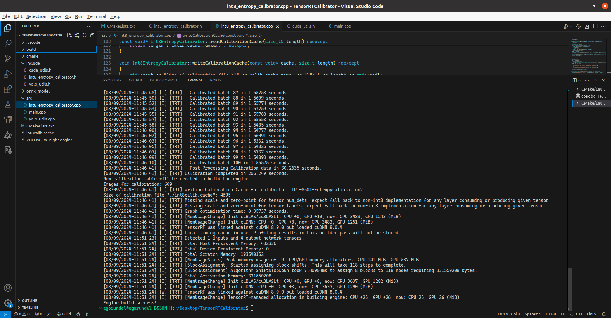

# int8_calibrator_cpp

### Description  

INT8 calibrator for ONNX model with dynamic batch_size at the input and NMS module at the output.

I am creating an INT8 calibrator in C++. Used `nvinfer1::IInt8EntropyCalibrator2`. I calibrate the ONNX model, generate the `calibration_data.cache` calibration file, and then create the TensorRT Engine using calibration.

I am using the ONNX model with a dynamic batch size at the input. 

### <span style="color:red">ATTENTION!</span>

Pay attention to your model input. 
This calibrator is suitable for models with input format: **batch_size * number_of_channels * width * height**.

To view what is at the input and output of your model, use the service: [Netron](https://netron.app)

**The input of our model has the following parameters:**
dynamic batch size * 3 * 640 * 640

**batch_size** = -1 (dynamic)  
**number_of_channels** = 3  
**width** = 640  
**height** = 640  


**The output of my model is an NMS Module with 4 outputs:** 
num_dets, boxes, scores, labels.


### What you need to change in code for you?

1. path to ONNX model

   ```cpp
   parser->parseFromFile("../onnx_model/yolov8m.onnx", static_cast<int32_t>(nvinfer1::ILogger::Severity::kWARNING));
   ```

2. batch size, input size and name of input node in model

   ```cpp
   Int8EntropyCalibrator calibrator(
       12, // batch size for calibration 
       sizeList, // sizes of Dims
       network->getInput(0)->getDimensions().d[2], // input_w_
       network->getInput(0)->getDimensions().d[3], // input_h_
       calibrationImagesDir, // img_dir with images for calibration
       cacheFile, // name of cache file
       network->getInput(0)->getName() // image of input tensor
   );
   ```

3. paths to calibration data (`data.txt`, which contains the paths to the images - about 1000+ photos from train dataset) and where you want to save a `calibration_data.cache`

   ```cpp
   const char* calibrationImagesDir = "../data";
   const char* cacheFile = "calibration_data.cache";
   ```

   

4. change a parameters for dynamic batch

   ```cpp
   profile->setDimensions(network->getInput(0)->getName(), nvinfer1::OptProfileSelector::kMIN, nvinfer1::Dims4{1, 3, network->getInput(0)->getDimensions().d[2], network->getInput(0)->getDimensions().d[3]});
   profile->setDimensions(network->getInput(0)->getName(), nvinfer1::OptProfileSelector::kOPT, nvinfer1::Dims4{6, 3, network->getInput(0)->getDimensions().d[2], network->getInput(0)->getDimensions().d[3]});
   profile->setDimensions(network->getInput(0)->getName(), nvinfer1::OptProfileSelector::kMAX, nvinfer1::Dims4{12, 3, network->getInput(0)->getDimensions().d[2], network->getInput(0)->getDimensions().d[3]});
   ```

5. path where you want to save engine

   ```cpp
   std::ofstream engine_file("./yolov8m.engine", std::ios::binary);
   ```

### How to launch?

```shell
# download repository
git clone https://github.com/Egorundel/int8_calibrator_cpp.git

# go to downloaded repository
cd int8_calibrator_cpp

# create `build` folder and go to her
mkdir build && cd build

# cmake 
cmake ..

# build it
cmake --build .
# or
make -j$(nproc)

# launch
./int8_calibrator_cpp
```

### **Screenshot of work:**



### Tested on:  

**TensorRT Version**: 8.6.1.6  
**NVIDIA GPU**: RTX 3060  
**NVIDIA Driver Version**: 555.42.02  
**CUDA Version**: 11.1  
**CUDNN Version**:  8.0.6  
