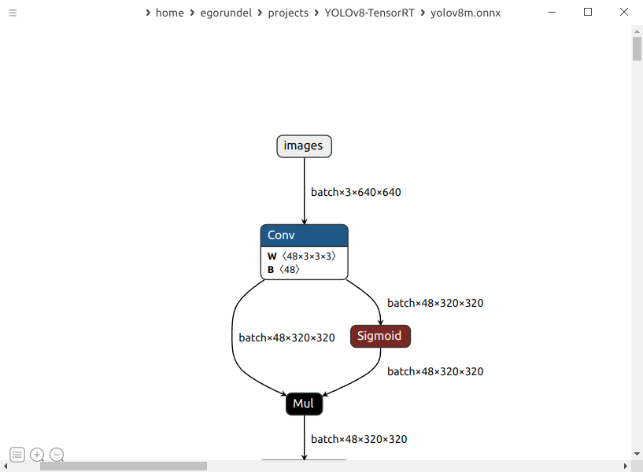

# int8_calibrator_cpp
INT8 calibrator for ONNX model with dynamic batch_size at the input and NMS module at the output.

## **IN PROGRESS...**

I am creating an INT8 calibrator in C++. I calibrate the ONNX model, generate the `calibration_data.cache` calibration file, and then create the TensorRT Engine using calibration.

I am using the ONNX model with a dynamic batch size at the input. 

**The input of our model has the following parameters:**
dynamic batch size * 3 * 640 * 640



**The output of my model is an NMS Module with 4 outputs:** 
num_dets, boxes, scores, labels.


#### What you need to change in code for you?

1. path to ONNX model

```cpp
/// path to ONNX model
const char* pathToONNX = "../onnx_model/yolov8m.onnx";
```

2. batchSize, inputSize and name of input node in model

```cpp
int batchSize_ = 6;
int currentBatch_ = 0;
int inputSize = 640;
const char * inputName = "images";
```

3. working with your input and outputs.

```cpp
/// For allocating memory (input and outputs in EfficientNMS)
void *buffers_[5];
float *input_ = new float[batchSize_ * 3 * inputSize * inputSize * sizeof(float)];      //  input (dynamic_batch x 3 x 512 x 512)
int *output0_ = new int[batchSize_ * sizeof(int)];                                      //  num_dets
float *output1_ = new float[batchSize_ * 4 * sizeof(float)];                            //  bboxes
float *output2_ = new float[batchSize_ * sizeof(float)];                                //  scores
int *output3_ = new int[batchSize_ * sizeof(int)];                                      //  labels
```

4. paths to calibration data (`data.txt`, which contains the paths to the images - about 1000+ photos from train dataset) and where you want to save a `calibration_data.cache`

```cpp
std::string calibrationDataPath = "../data/data.txt";
std::string cacheFile = "./calibration_data.cache";
```

5. change a parameters for dynamic batch

```cpp
profile->setDimensions(calibrator.getInputName(), nvinfer1::OptProfileSelector::kMIN, nvinfer1::Dims4{1, 3, calibrator.getInputSize(), calibrator.getInputSize()});
profile->setDimensions(calibrator.getInputName(), nvinfer1::OptProfileSelector::kOPT, nvinfer1::Dims4{6, 3, calibrator.getInputSize(), calibrator.getInputSize()});
profile->setDimensions(calibrator.getInputName(), nvinfer1::OptProfileSelector::kMAX, nvinfer1::Dims4{12, 3, calibrator.getInputSize(), calibrator.getInputSize()});
```

6. path where you want to save engine

```cpp
std::ofstream engine_file("../engine/test.engine", std::ios::binary);
```

